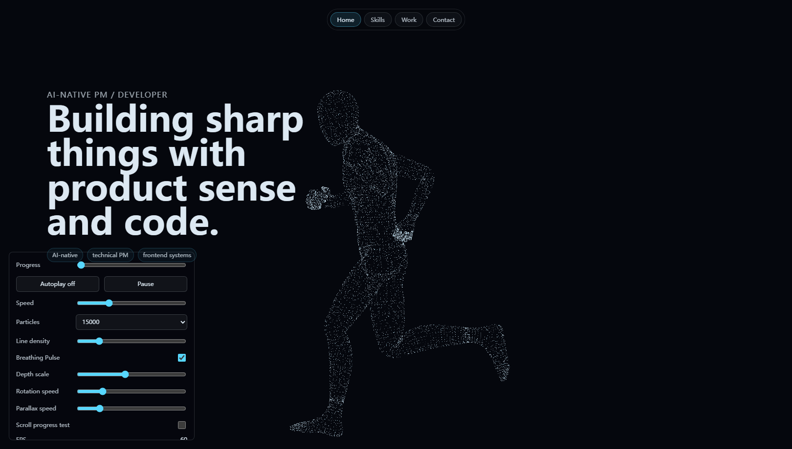

# Scroll-Driven Particle Portfolio Prototype

> 状态：`Prototype / Safe archive`
>
> 类型：个人独立开发的 Three.js / WebGL 作品集首页交互原型
>
> 用途：源码安全归档、教师审阅与后续迭代；不是已上线的完整个人网站



这是一个以滚动为时间轴的粒子叙事首页原型。同一组粒子在 Runner、Flow、Chen–Lee 混沌吸引子和作者设计的 20D 概念网络之间连续形变，用四幕视觉状态探索个人能力与作品入口的表达方式。

本仓库保存核心交互源码、三个阶段实验和六张经过筛选的研发截图。它如实保留当前原型的能力与不足，不把概念目标、截图帧率或作者陈述包装成生产验证结果。

当前 GitHub 仓库设为 Private。教师需要先接受仓库协作者邀请，之后才能在线查看或使用 **Code → Download ZIP** 下载。

## 可以从代码中核验的内容

- 使用 Three.js `0.181.2` 与原生 HTML/CSS/JavaScript 构建 WebGL 场景。
- 默认更新 15,000 个粒子，并在四个视觉状态之间连续映射。
- 对带骨骼动画的 FBX 网格进行面积加权三角形采样、重心绑定与蒙皮顶点跟随。
- 使用 RK4 数值积分预生成 120,000 点 Chen–Lee 轨迹。
- 使用自定义 ShaderMaterial、滚动状态机、过渡吸附、文字延迟显现和参数诊断面板。
- 将作者设计的 20D 概念结构映射为由 18 条 strand、多组频率/相位、深度层和线网关系共同生成的三维视觉。

更严格的证据状态见 [证据与主张边界](docs/evidence-and-claims.md)。

## 个人职责与 AI 使用边界

这是个人独立项目。作者确认由本人提出并完成核心概念、视觉与交互方向、技术实现、整合和迭代判断；开发过程中使用 Codex、Claude 与 Gemini 作为辅助工具。

三种工具的具体任务记录尚未随本次归档提交，因此“独立开发”“AI 辅助过程”和“20D 结构设计归属”目前按作者陈述记录。页面运行时不包含 LLM、Agent、RAG 或其他 AI 产品功能，本项目不作为 AI/Agent 应用案例陈述。

## 运行与资产边界

```powershell
npm ci
# 自行准备有权使用的兼容动画 FBX，并保存为 assets/Running.fbx
npm start
```

然后访问 `http://127.0.0.1:5177/`。

本归档**不包含**开发时使用的原始 FBX 文件。当前交互源码仍会请求 `assets/Running.fbx`，所以全新克隆只有在审阅者自行提供有权使用的兼容资产后才能完整复现。缺少该文件时，代码仍可审阅，但浏览器中的完整四幕交互无法正常加载。

资产条件与排除原因见 [assets/README.md](assets/README.md) 和 [第三方说明](THIRD_PARTY_NOTICES.md)。

## 仓库导览

| 文件 | 用途 |
|---|---|
| `index.html` | 四幕集成原型；原开发文件名为 `homepage-assembly-lab.html` |
| `runner-model.js` | FBX 加载、动画、表面采样与粒子目标更新 |
| `scroll-morph-lab.html` | Runner → Flow 阶段实验 |
| `flow-chenlee-lab.html` | Flow → Chen–Lee 阶段实验 |
| `chenlee-manifold-lab.html` | Chen–Lee → 概念网络阶段实验 |
| `server.js` | 仅用于本机预览的静态服务器 |
| `screenshots/` | 六张隐私复核后的原型与调试截图 |
| `docs/` | 架构、设计、证据边界、归档清单与教师审阅入口 |

第一次查看建议从 [教师审阅指南](docs/teacher-review-guide.md) 开始。

## 当前限制

- 不是完整作品集：Work、Links 与联系方式仍为占位内容。
- 没有自动化测试、CI、生产构建或正式部署配置。
- 没有系统性的性能、跨浏览器、移动端或无障碍验证。
- 截图中的 FPS 仅是当次调试界面读数，不是性能基准。
- “20D”是作者设计的生成式视觉结构与命名；当前材料不支持“经数学证明的严格 20 维流形算法”这一表述。
- 当前 import map 依赖本地 `/node_modules/`，不能直接作为 GitHub Pages 子路径部署。

## 归档与权利

本仓库是从本地开发目录生成的安全审阅副本，原目录未被修改。依赖目录、临时提取脚本、未筛选截图、本机路径材料和第三方原始 FBX 均未进入 Git。

当前未授予开源许可，详见 [LICENSE.md](LICENSE.md)。
