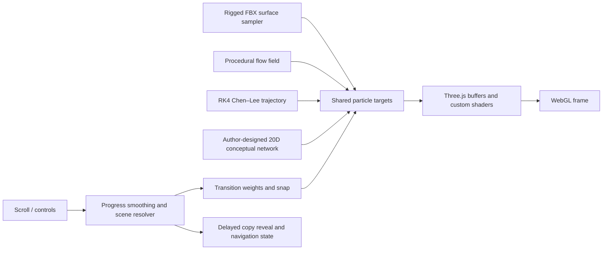

# Architecture

The prototype is deliberately small in file count but dense in runtime behavior. Most scene, interaction, shader, and UI code remains in `index.html`; animated-runner sampling is separated into `runner-model.js`.

## Main modules

### `runner-model.js`

1. Loads the locally supplied animated FBX.
2. Finds renderable mesh triangles and computes triangle-area weights.
3. Samples points with barycentric coordinates.
4. Stores per-particle bindings.
5. Advances the AnimationMixer and updates sampled targets from deformed/skinned vertices.

### `index.html`

- Creates the renderer, camera, buffers, materials and UI.
- Precomputes a 120,000-point Chen–Lee trajectory using RK4.
- Builds Flow, Chen–Lee and concept-network bindings for the same particle identities.
- Resolves scroll progress into stable and transition segments.
- Blends target positions and colors, then updates GPU attributes.
- Coordinates copy reveal, navigation, snap behavior, breathing and diagnostics.

## Prototype constraints

- HTML, CSS and most JavaScript are concentrated in one large file.
- The import map assumes the local server exposes `/node_modules/`.
- Runner initialization requires the omitted `assets/Running.fbx`.
- No build-time optimization, automated tests or runtime fallback is included in this safe snapshot.
